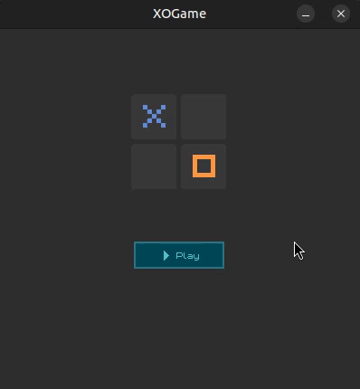

# ❎ **XO** ⏺️



## 📃 Description

TicTacToe game clone. Nothing really special, except I tried to go "all in" with abstraction, testing and mocks (for learning purposes).

## 🔧 Developed using

[](#)
[](#)

## 🖥️ Platforms

[](#)
[](#)

## 🎮 **How to play**

Clone this repo, build with CMake and run:

```
$ cmake -B build -S .
$ cd build && make
$ cd src/ui && ./xo-game
```
